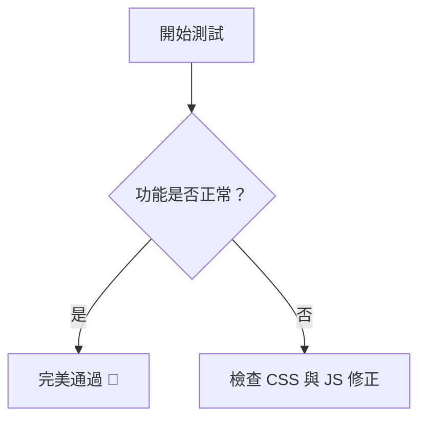

# 🌟 萬能測試 Markdown 文件 (Universal Test Document)

這是一份用來測試所有自訂擴充功能、Markdown 排版與互動特效的綜合測試文件。

---

## 1. 基礎文字與排版 (Basic Typography)
這是一般段落文字，包含**粗體**、*斜體*、~~刪除線~~，以及行內程式碼 `console.log('Hello World');`。
這裡有一個內部錨點測試連結：[跳轉到最下方結語](#結語)。

> 這是一段引言區塊 (Blockquote)。用來測試區塊引號的樣式與邊框是否正常顯示。

---

## 2. 秘密與防雷文字 (Spoiler Text)
測試 Discord 風格的實體撕開貼紙防雷文字[cite: 2]：
* 滑鼠懸停或點擊：這是一段 ||非常機密的隱藏劇透文字，點擊可以把它撕開！||
* 裡面也可以夾雜 ||`程式碼` 或 **粗體**||。

---

## 3. 動態高光與 X 光透視跑馬燈 (Highlights & Marquee)

### 3.1 行內高光 (Inline Highlight)
測試各種狀態與徽章的行內跑馬燈[cite: 2]：
* 預設高光：++這是一般的高光文字，點擊可以發動 X 光透視跑馬燈++。
* 帶有狀態徽章：++[NEW]這是一個帶有 NEW 徽章的高光文字++。
* 帶有群組顏色：++[MAJOR]重要核心更新提示++。

### 3.2 區塊型高光 (Block Highlight)
測試多行區塊透視框是否能正常運作[cite: 5]：

:::highlight[WIP]
這是**多行高光區塊**！
它可以跨越多行，並且完美支援內部的所有 Markdown 語法：
* 清單項目 A
* 清單項目 B，包含 `Code`
* ||區塊內也可以放撕開貼紙！||
:::

---

## 4. 表格與清單 (Tables & Lists)

### 項目清單
* 第一項：項目測試
* 第二項：包含外部超連結 [外部網站](https://github.com)[cite: 2]
* 第三項：包含內部 SPA 路由連結 [日記的故事](?p=storyOFdiary&a=introduction#yona)[cite: 2]

### 功能對照表
| 功能項目 | 語法格式 | 支援狀態 |
| :--- | :--- | :--- |
| 防雷貼紙 | `\|\|文字\|\|`[cite: 2] | ✅ 完美支援 |
| 行內高光 | `++[Badge]文字++`[cite: 2] | ✅ 完美支援 |
| 區塊高光 | `:::highlight`[cite: 5] | ✅ 完美支援 |

---

## 5. 程式碼與圖表引擎 (Code & Mermaid)

### 程式碼區塊 (JavaScript)
```javascript
const universalTest = () => {
    console.log("System initialized successfully.");
};
universalTest();
```

### Mermaid 流程圖引擎


## 6. 結語
測試到此結束。如果以上所有特效（撕開貼紙、X光跑馬燈、區塊高光、圖表、錨點跳轉）都能完美呈現，代表系統運作完全正常！