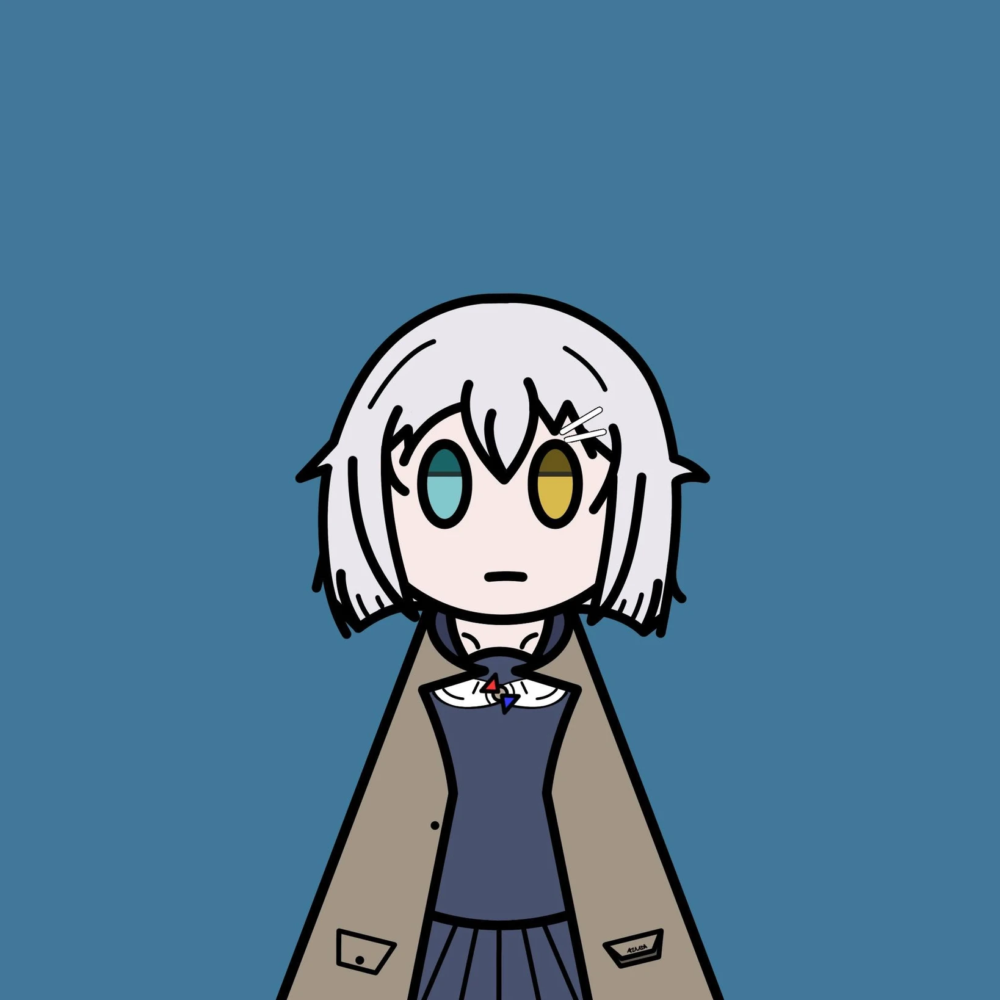
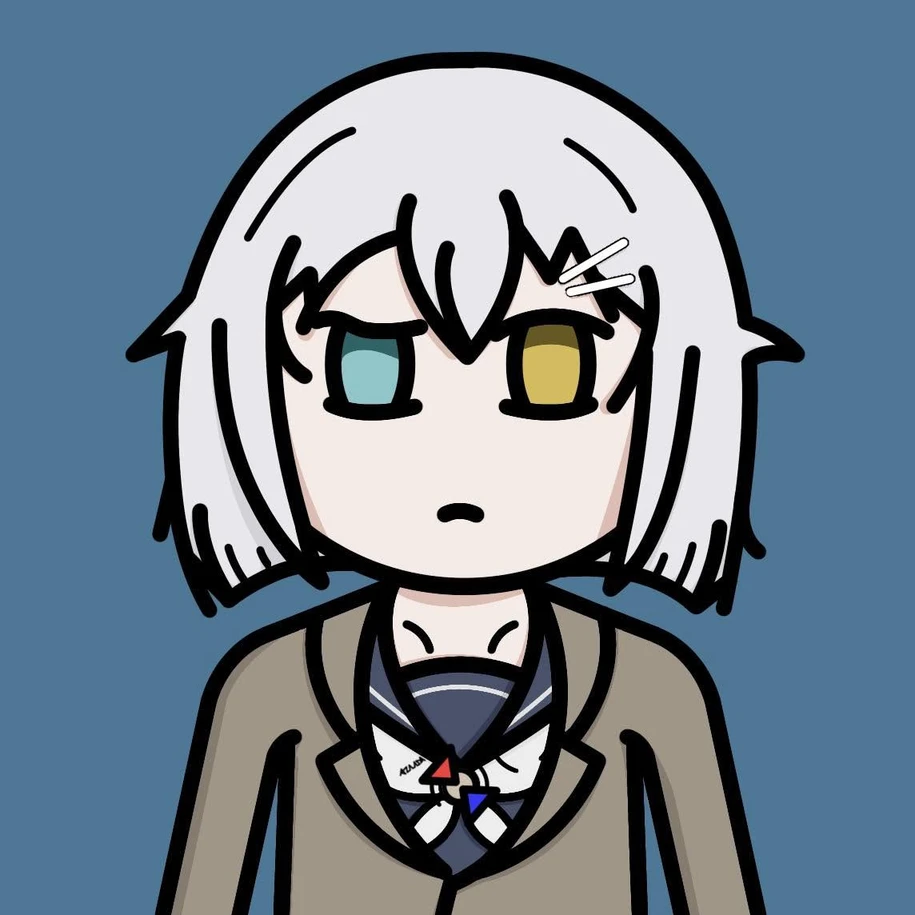
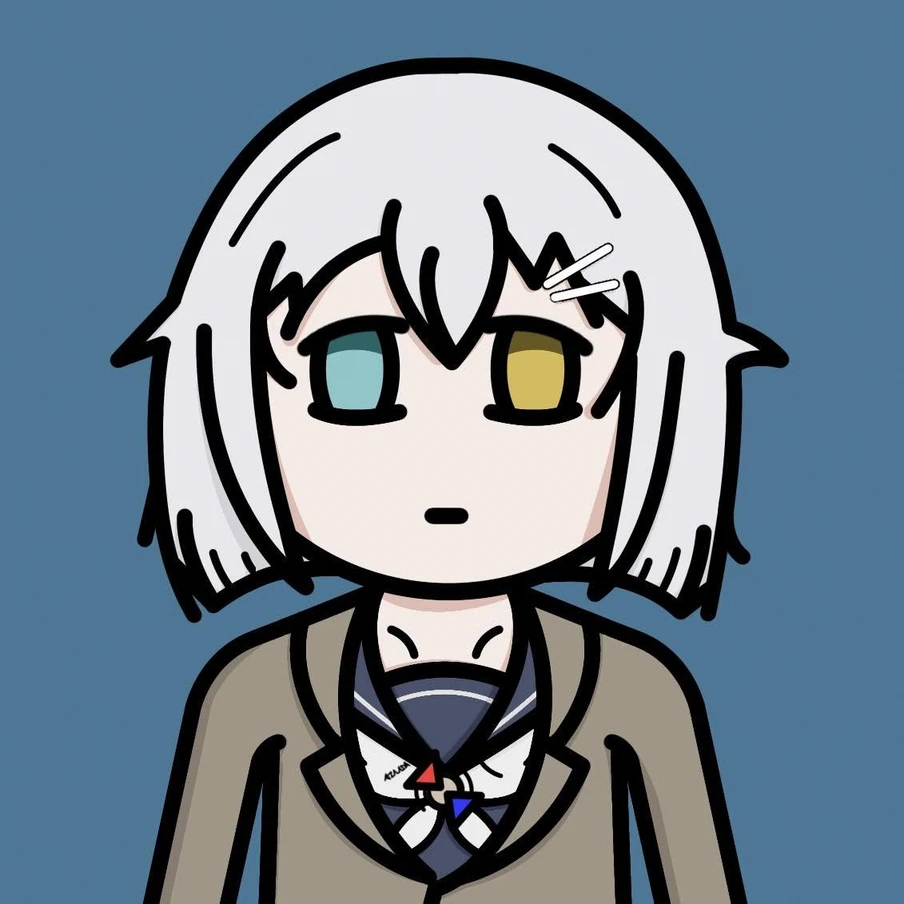
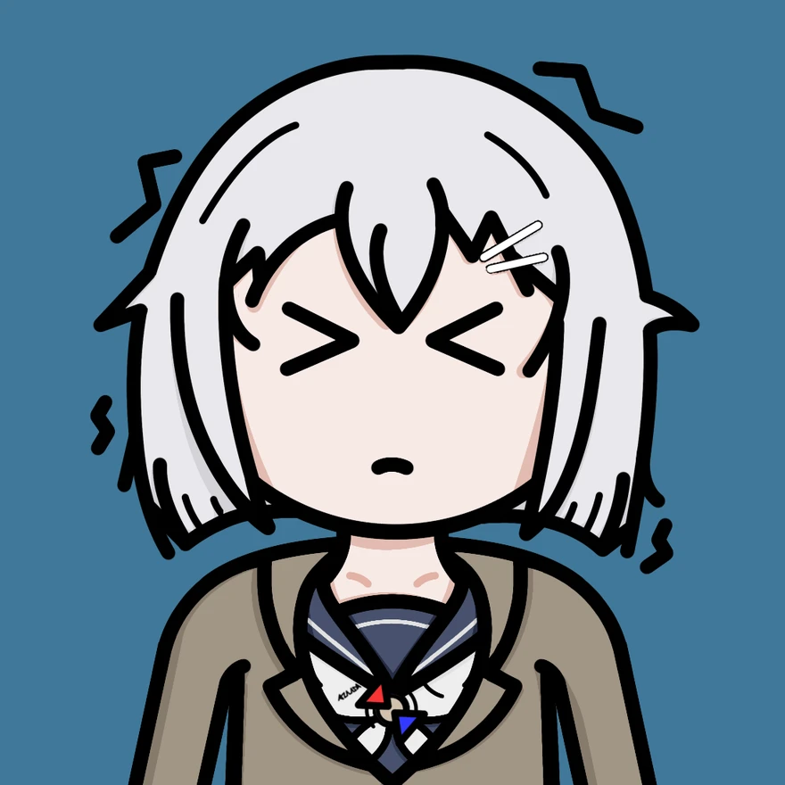
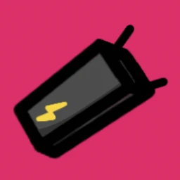
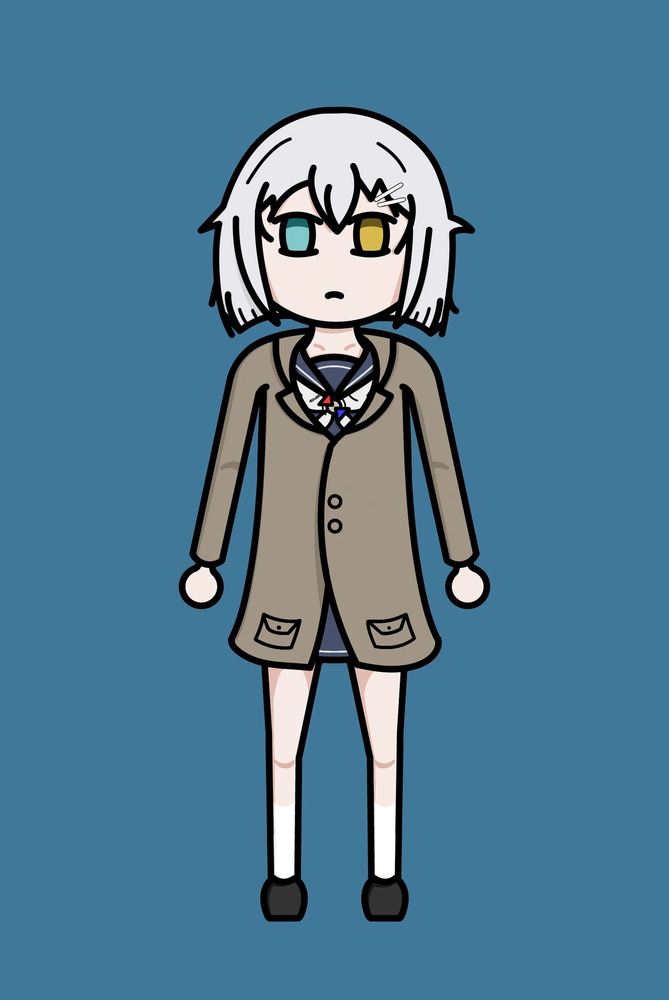
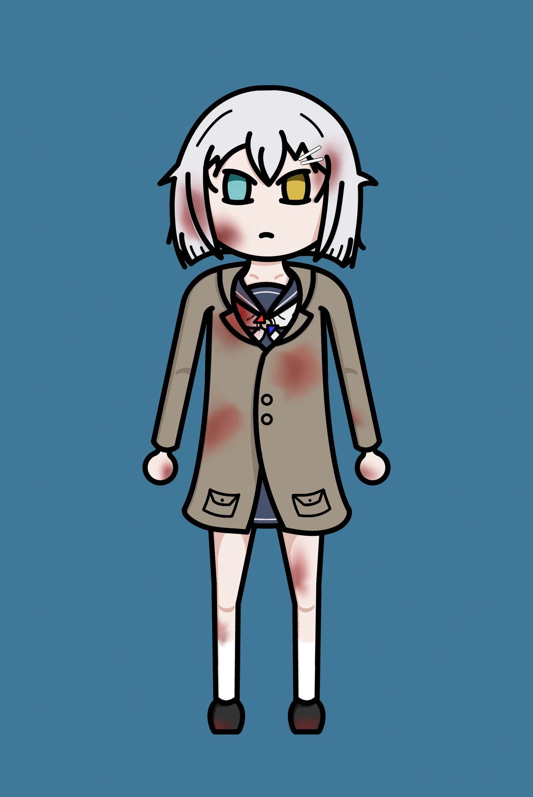

# 『梓川風』
<figure class="float-right">
  
  <figcaption>基礎方塊</figcaption>
</figure>

## 表情

  <figure>
  <figcaption>困惑</figcaption></figure>
  <figure>
  <figcaption>難過</figcaption></figure>
  <figure>
  <figcaption>顫抖</figcaption></figure>

> (coc7th | OC)  

Tag：  
作家、博士、偵探  

經歷：  
為了和編輯討論下一部作品而搭上了末班車，結果發生了不可思議的事情。  
不久後為了新作品的取材而參訪了神秘的研究機構，還沒開始工作就先睡了兩小時，醒來後搜了屍體，跟著大家亂跑。  
後來推著椅子(好像沒用)、拿了電擊槍跟大家一起面對不可名狀的怪物(伺服器成精了!?)  
最後打敗了||磨死了||怪物，旅途就結束了。(所以我說那個取材呢？)
<—— 現在在這

## 持有物品

  <figure>
  <figcaption>手電筒</figcaption></figure>
  <figure>
  <figcaption>電擊器</figcaption></figure>

## 服裝

  <figure>
  <figcaption>常服</figcaption></figure>
  <figure>
  <figcaption>水手服</figcaption></figure>
  <figure>
  <figcaption>旅途</figcaption></figure>

