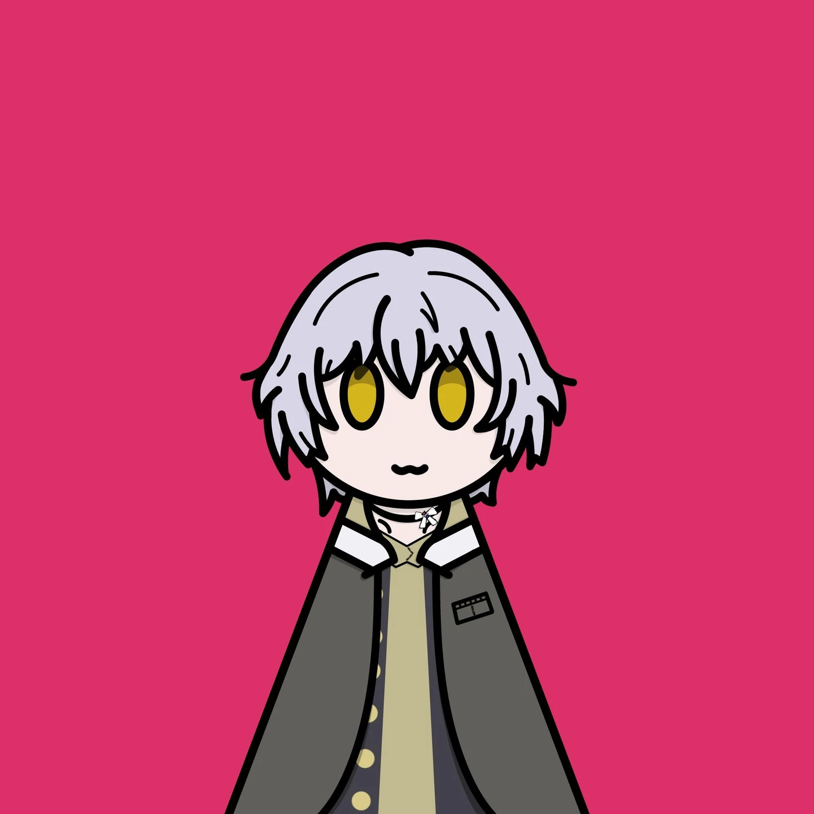
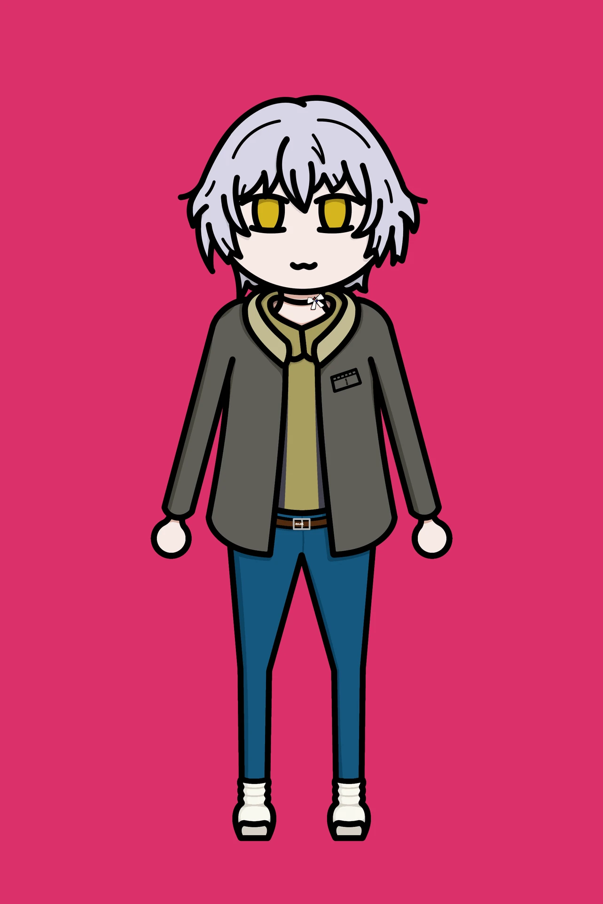

# 『高松彩空』
<figure class="float-right">
  
  <figcaption>基礎方塊</figcaption>
</figure>

>（coc6th | OC）

Tag：
記者、爬山、隨性

—— 「好想去那邊看看，可是離大家太遠感覺很危險。」

經歷：
從社會新聞轉戰體育新聞的記者，為了宏大的目標（~~賺錢~~），決定加入登上傳說的行列！  
< —— 現在在這裡

## 服裝

  <figure>
  <figcaption>常服</figcaption></figure>

