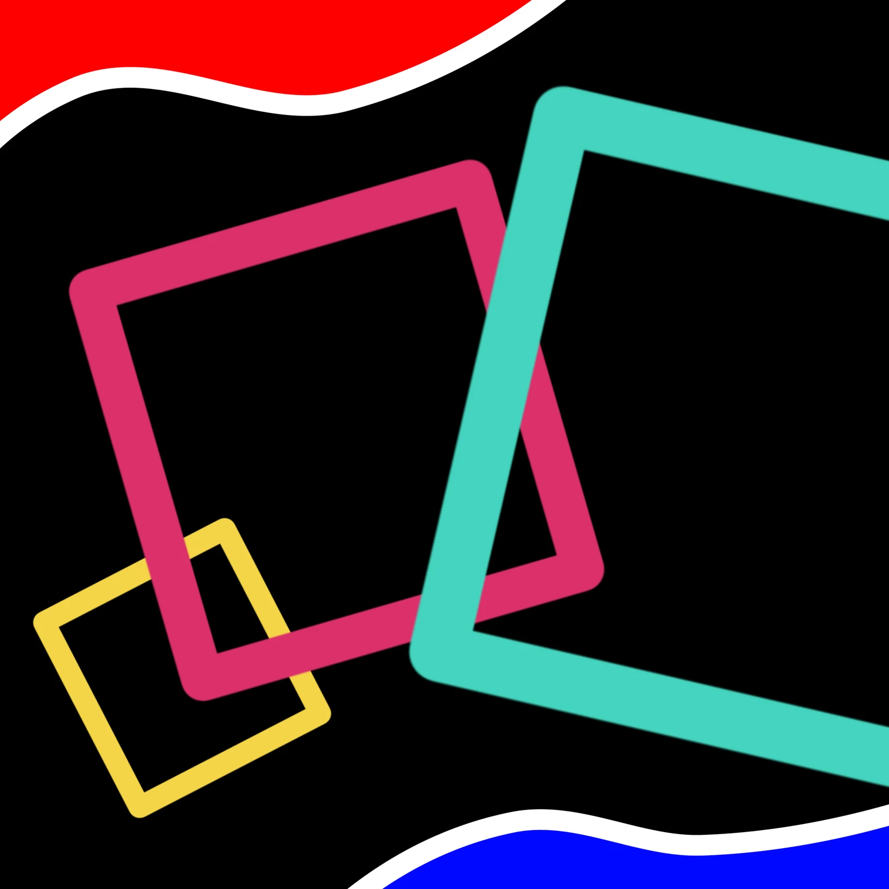

# 「比大小」

附近的公園很大。  
有沙坑，有溜滑梯，有鞦韆；  
還有花草，還有昆蟲，還有陌生人，  
天氣好的話能玩上一整天，還不願回家。  
女孩是這麼認為的，好奇著還有什麼地方比較大？  

一站遠的學校很大，比公園大。  
有教室，有體育館，有實驗室；  
還有盆栽，還有蠶寶寶，還有同學，  
天氣陰雨的話能待上一整天，還不想回家。  
少女是這樣認為的，想像著還有什麼地方比較大？  

另一個縣市的公司很大，比學校大。  
有隔間，有會議室，有雜物間；  
還有人造花，還有玩偶，還有同事，  
天氣糟的話能待上一整天，還不能回家。  
女子是這樣認為的，思考著還有什麼地方比較大？  

她像是有了答案，  
於是趁著這次年假，回到了那個小小的公園，盪著鞦韆。  
直到一個女孩說道：「我想玩鞦韆～」，並且女孩的母親拉走女孩之前停下，隨後離開了公園。  
而女孩如願盪起了鞦韆。
