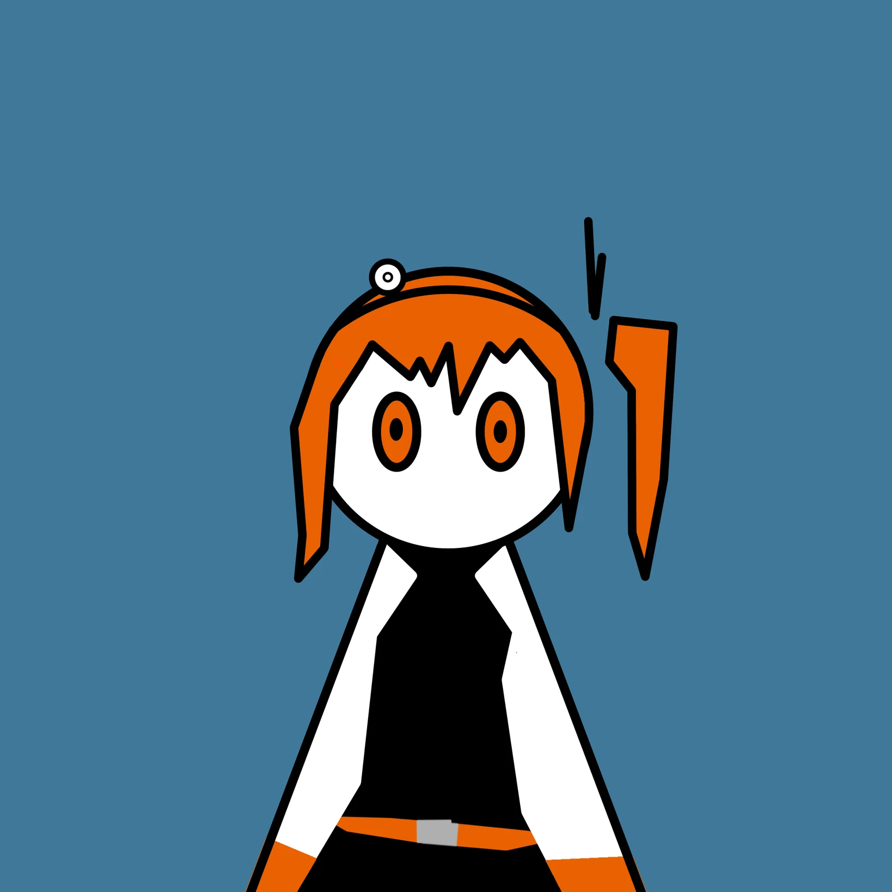

# 「學習」

少女很崇拜她，  
她是如此的耀眼，坐擁著少女所嚮往、排除了少女的缺點、前進著少女所夢想、超越了少女所成就。  

於是少女決定向她學習。
 

第一年，  
少女考試考贏過了她。  

第二年，  
少女觀摩那個小圈圈。  

第三年，  
少女問了她一個問題。  

第四年，  
升學，少女和她分別。  

第五年，  
少女才有了個小圈圈。  

第六年，  
少女問了自己一個問題。  
 
「妳想做什麼？」
