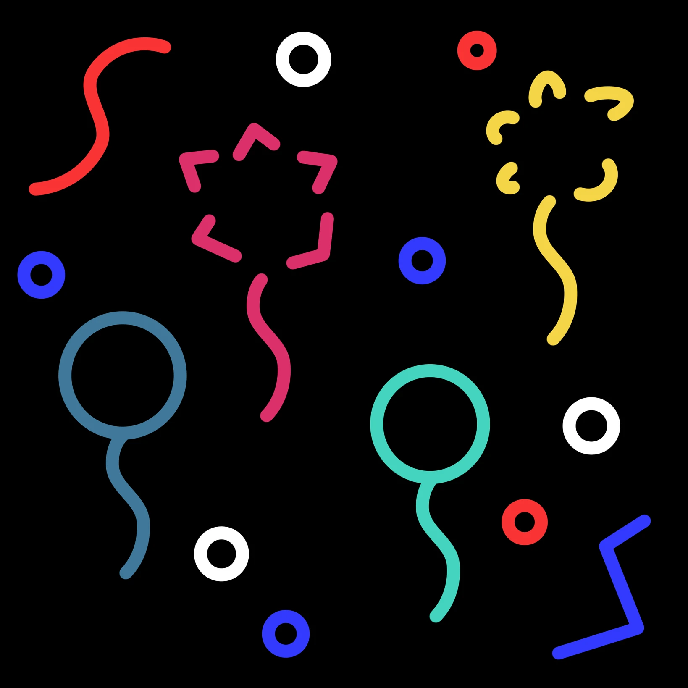

# 「氣球」

有個人在公園旁賣氣球，好多人都買了一個。  
女孩就這樣看著他們的氣球  
從溜滑梯飛到鞦韆、  
從炙熱的皮膚到冷色的雙瞳，  
有時還會突然大叫一聲，又或是到了怎麼仰望都看不到的地方。  
 
當然，女孩沒有買氣球。  
   
有個人在公園旁賣氣球，好多人都買了一個。  
少女就這樣看著他們的氣球  
從蹺蹺板飛到吊桿、  
從滾燙的座椅到涼爽的空氣，  
有時還會突然爆炸開來，又或是到了怎麼伸手都抓不到的地方。  
 
當然，少女沒有買氣球。  
   
有個人在公園旁賣氣球，好多人都買了一個。  
女子就這樣拿著自己的氣球  
從公園走到了馬路、  
從痠透的右手到提物的左手。  
 
當然，女子覺得很苦惱。
