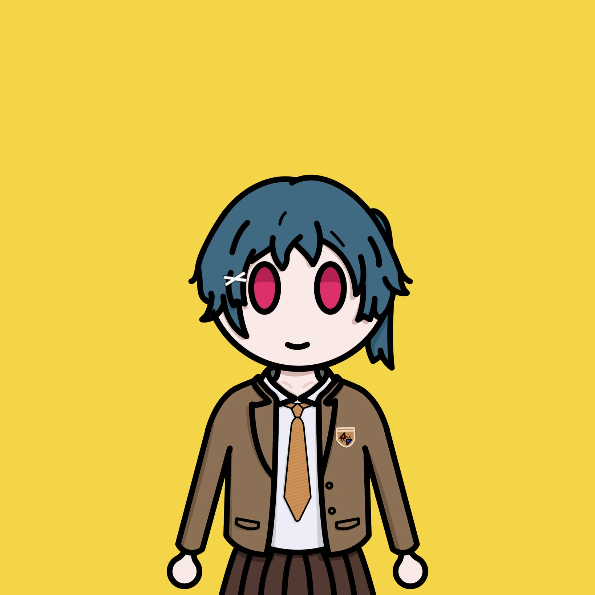
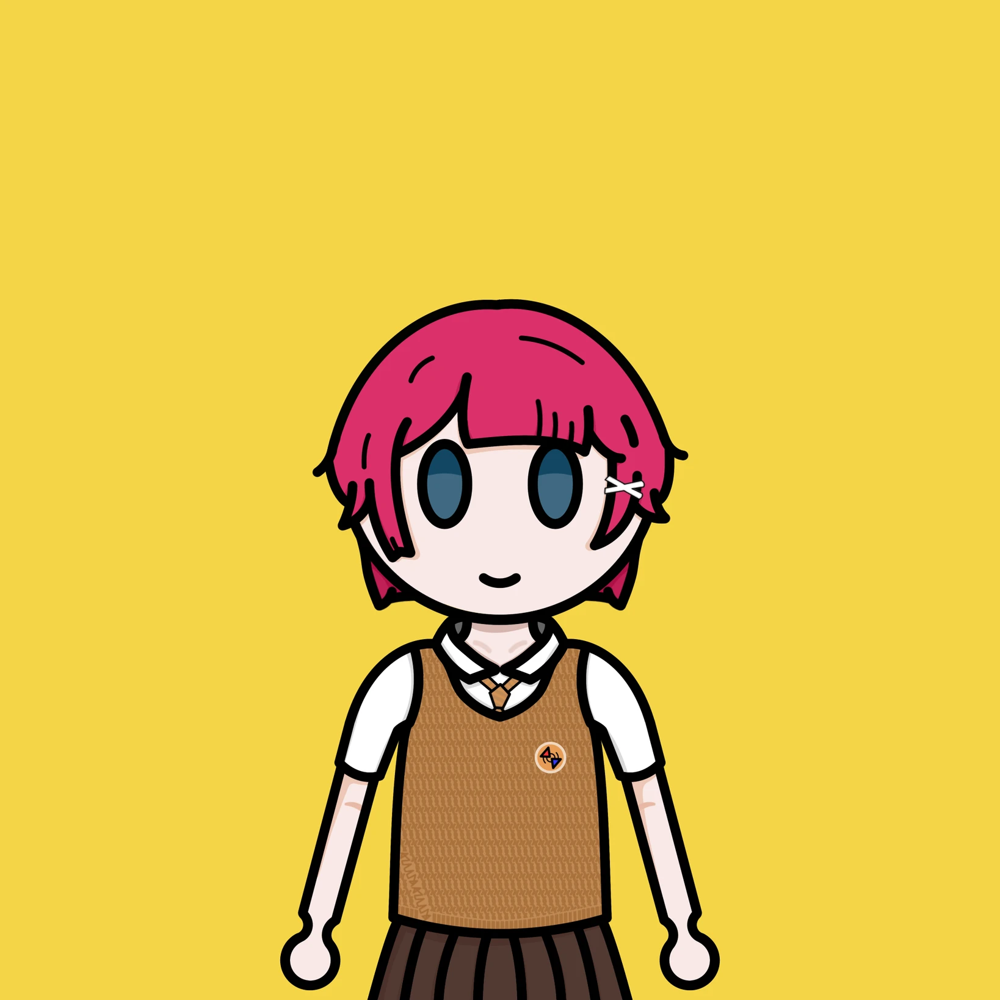

# 角色介紹

## 戶賀有里

一個普通的女子高中生。  
日復一日的過著平淡的日常，直到夜中同學的打擾，  
開始了屬於她們兩個的日常。  
> [角色設定 & 圖像](?p=azu5atellite&a=toga)

## 夜中

—— 「有一個聲音一直告訴著我」  

一個女子高中生。  
與戶賀有里同班，會時不時的去找她玩，  
開朗、行動派、意想不到是她的形容詞。
> [角色設定 & 圖像](?p=azu5atellite&a=yona)  
